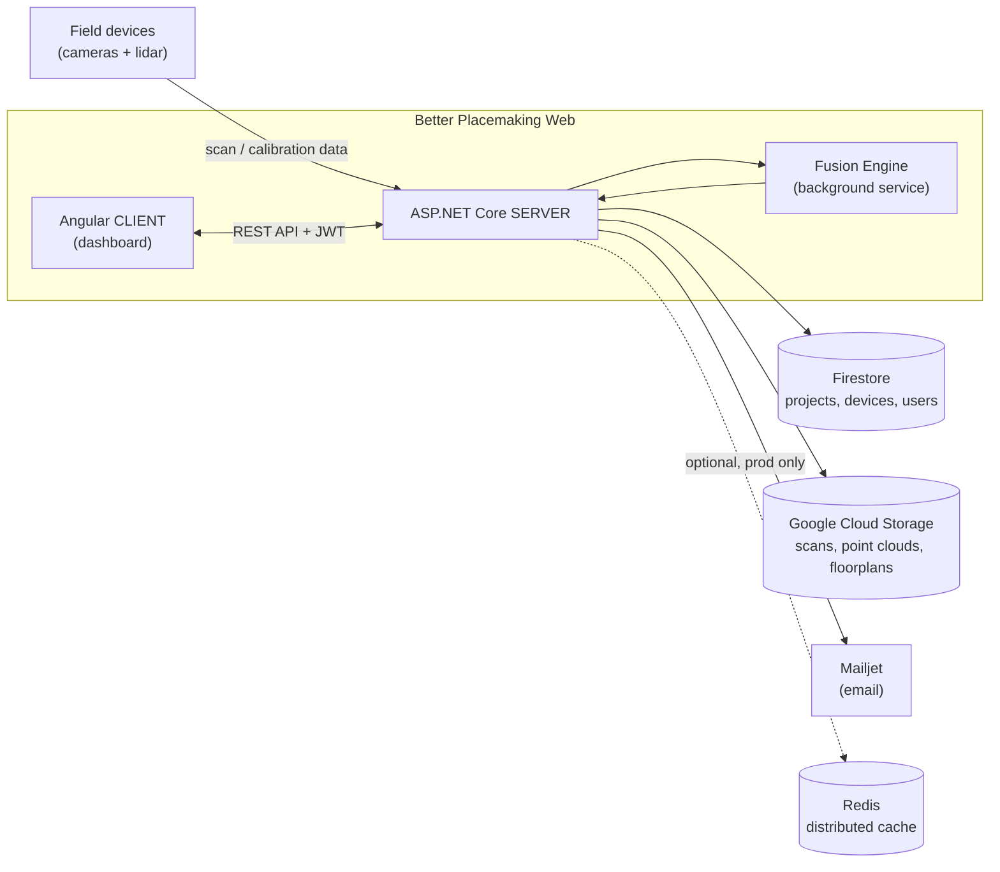

# Better Placemaking — Web

Web platform for the **Pipeline to Better Placemaking** senior design project. It's the admin/operator dashboard for managing pedestrian-observation devices in the field, running lidar/camera calibration, fusing multi-sensor data, and visualizing the results in 3D.

This repo contains two independent apps:

| Folder | What it is |
|---|---|
| `BetterPlacemaking.CLIENT` | Angular 20 frontend (PrimeNG + Tailwind) |
| `BetterPlacemaking.SERVER` | ASP.NET Core 8 API (Firebase/Firestore, Google Cloud Storage, optional Redis) |

## Prerequisites

- **Node.js** (LTS) + npm
- **.NET 8 SDK** — version is pinned in `global.json`, so `dotnet` will complain if you have the wrong major version installed
- A **Firebase service account JSON** for local dev — ask a team lead for one; it's never committed to the repo
- Optional: a local **Redis** instance if you want to exercise the distributed-cache path used in production (the app falls back to in-memory caching without it)

## Getting started

### 1. Configure the server

**macOS / Linux (bash/zsh):**

```bash
cd BetterPlacemaking.SERVER
cp .env.example .env
```

**Windows (PowerShell):**

```powershell
cd BetterPlacemaking.SERVER
Copy-Item .env.example .env
```

Fill in the values in `.env` — see the comments in that file for what each one does and where to get it.

### 2. Run the server

The `dotnet` CLI itself is identical on every OS:

```bash
cd BetterPlacemaking.SERVER
dotnet restore
dotnet run
```

The API comes up at `http://localhost:5123` and opens Swagger automatically (`/swagger`). If you need HTTPS locally (`https://localhost:7058`), run `dotnet run --launch-profile https` — but trusting the dev cert first works a bit differently per OS:

- **macOS:** `dotnet dev-certs https --trust` — you'll get a Keychain prompt asking you to confirm.
- **Windows:** `dotnet dev-certs https --trust` — you'll get a certificate-store/UAC prompt asking you to confirm.
- **Linux:** `--trust` isn't supported by the .NET CLI on Linux. The cert still gets generated, but you have to trust it manually per your distro/browser. Easiest path: just skip HTTPS locally and use the default `http` profile above — that's what most of the team should be doing anyway.

### 3. Run the client

Also identical across macOS, Linux, and Windows:

```bash
cd BetterPlacemaking.CLIENT
npm install
npm start
```

The app comes up at `http://localhost:4200` and points at the API URL set in `src/environments/environment.ts` (defaults to `http://localhost:5123`, matching the server's `http` launch profile above).

## Current Architecture

A simple picture of what talks to what:



In words: field devices upload scan and calibration data to the API. The API stores structured data (projects, devices, users) in Firestore and larger files (scans, point clouds, floorplans) in Cloud Storage. The Fusion Engine runs as a background service, pulling that data, combining it, and handing results back to the API for the client to display in the 3D viewer. Mailjet handles outgoing email (password resets, notifications); Redis is only wired in for production, so it's not part of the local dev loop unless you set it up yourself.

## Feature map

The client and server are organized by the same feature areas — if you're working on one side, this is roughly where its counterpart lives:

- **Auth & permissions** — `CLIENT/src/app/guards`, `services/auth-*`, `directives/permission.directive.ts` ↔ `SERVER/Authorization/*`, `Controllers/AuthController.cs`, `LoginController.cs`
- **Projects & devices (admin)** — `CLIENT/src/app/views/admin/*` ↔ `SERVER/Controllers/ProjectController.cs`, `DeviceController.cs`, `AdminController.cs`
- **Scanning & calibration** (lidar/camera) — `CLIENT/.../views/projects/selected/calibration`, `.../vision`, `admin/devices/*` ↔ `SERVER/Controllers/ScanController.cs`, `HomographyController.cs`, `IntrinsicsController.cs`, `RplidarController.cs`
- **Sensor fusion** — `CLIENT/.../views/projects/selected/fusion` ↔ `SERVER/Services/FusionEngine.cs`, `FusionSchedulerService.cs`, `Services/BackgroundServices/FusionBackgroundService.cs`
- **3D visualization** — `CLIENT/.../views/projects/selected/model`, `CLIENT/src/app/solid-objects` ↔ `SERVER/Services/Visualizer/*`
- **Tracking / analytics output** — `SERVER/Controllers/TrackingController.cs`, `Services/TrackingDataService.cs`

## Points of clarity

Things that look like mistakes at first glance but are either intentional or just pre-existing quirks worth knowing about before you go "fix" them:

- **`SECRET_KEY` in `.env` is not a general app secret** — despite the generic name, it's specifically Mailjet's secret key, paired with `MAILJET_KEY`. Renaming it to `MAILJET_SECRET_KEY` has been suggested but not done yet.
- **View file naming is inconsistent on purpose (sort of).** Some Angular view files drop the `.component` suffix (`login.ts`, `dashboard.ts`) while others keep it (`solid-objects-scene.component.ts`). Both exist in the codebase today — going forward, prefer keeping `.component.ts` to match Angular's own style guide, but don't be surprised to see the older pattern in older files.
- **DTOs for a feature aren't always next to that feature's models.** For example, `Models/Fusion/` holds Fusion's domain models, but `FusionDtos.cs` lives separately in `Models/Dtos/`. Same pattern for Homography. If you're looking for "everything about Fusion," check both locations.
- **`Controllers/` is flat; `Services/` is grouped by feature.** `Services/` has subfolders like `Visualizer/`, `Rplidar/`, `ScanCombine/`, and `BackgroundServices/`, but all 28+ controllers sit in one flat folder. Not a bug, just an inconsistency to be aware of when navigating between a controller and its service.
- **The `.sln` file lives inside `BetterPlacemaking.SERVER/`, not at the repo root.** If you're opening this in Visual Studio expecting a root-level solution file, it's one folder down.
- **`service.json` at the repo root is a Cloud Run deployment config, not a secrets file** — but it does contain internal project identifiers and a service account email. It's not a credential leak, but treat it as internal info, not something to reference externally.

## Known leftover scaffold code

A few things in the tree don't appear to be used anywhere and look like initial project scaffolding that never got cleaned up. Worth confirming with the team and removing if nobody's relying on them:

- **`views/projects/selected/dashboard/dummy.html` and `dummy.ts`** (client) — not imported or routed to anywhere in the app. Looks like a leftover placeholder component.
- **`SampleController.cs` and `Services/SampleService.cs`** (server) + **`SampleService` / `sample-service.spec.ts`** (client) — a client→server "ping" check, likely left over from initial setup to confirm the two apps could talk to each other. The client's `SampleService` isn't referenced anywhere else in the app, and the server's `SampleService` is only wired up via DI registration in `Program.cs` — nothing else calls into it. It also inherits from `ControllerBase`, which is a copy-paste artifact (services shouldn't extend that class), another sign it was never cleaned up.
